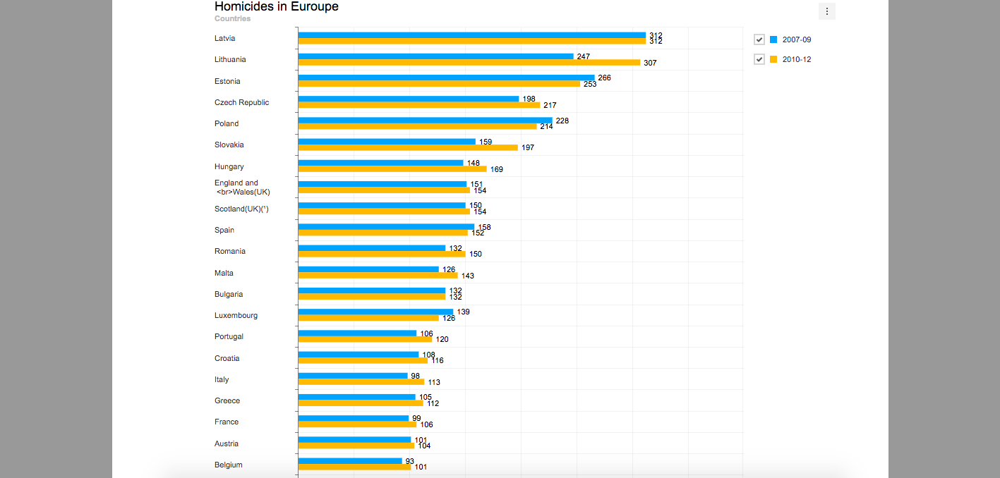

# [BeCode]JavaScript Datavisualisation Challenge - Europe Crimes Statistics

## Objectives 

The challenge was an opportunity to utilise and harness `HTML / CSS / JavaScript` knowledge and skills acquired thus far and to get to know and integrate useful and powerful **Third-party Libraries** such as `Chart.js` and `TOAST UI`. 

Therefore, having completed the challenge, I have consolidated and acquired new following skillsets:
- **DOM** manipulation.
- **AJAX/FETCH** request.
- Knowing and using [**Chart.js**](https://www.chartjs.org/) and [**TOAST UI Chart**](https://ui.toast.com/tui-chart/).
- **problem-solving** : design a logical solution to implement the expected result.
- **Testing and Debugging** using the DevTool console.

## Evaluation

The evaluation method chosen is a self-evaluation based on the following indicators:

#### 1. handling of the DOM:
- [x] I was able to find the right selector to do it.
- [x] I was able to inject the graph in the right place on the page via javascript.
- [x] I was able to retrieve the html data in a format adapted to my javascript code.
#### 2. Request ajax/fetch:
- [x] I was able to receive the answer from the remote server in json.
- [x] Then, I was able to build a callback function to process this data.
#### 3. Use of third party libraries:
- [x] I was able to integrate the third-party library into my application.
- [x] I used the documentation provided by the library.
- [x] I was able to generate the 2 inline data graphs.
- [x] I was able to generate the "remote data" graph.
#### 4. Problem-solving:
- [x] Syntactic rigor: I was able to translate the processes I imagined into javascript syntax.
- [x] Logical thinking: Through iterations and trial and error, I was able to find a logical path that works to address the issues raised by the client's request. Specifically:
  - [x] I was able to generate the 2 inline data graphs.()
      - [x] I was able to generate the "remote data" graph.
  - [x] I was able to build a callback function to process remote data (received via ajax).
    - [x] I was able to make the realtime graph refresh in real time.
    - [x] I was able to display the detailed data when I hover the mouse.
#### 5. Debugging:
- [x] I use the console to understand what is happening and compare what I am trying to program with what the machine is doing.
#### 6. Separation of concerns:
- [x] If I disable javascript, the user experience is satisfactory, the user has access to data and content
- [x] If I enable javascript, the tables are enhanced with an interactive graph.

## Previews of the resulted graphs

**THANKS FOR VIEWING!**
